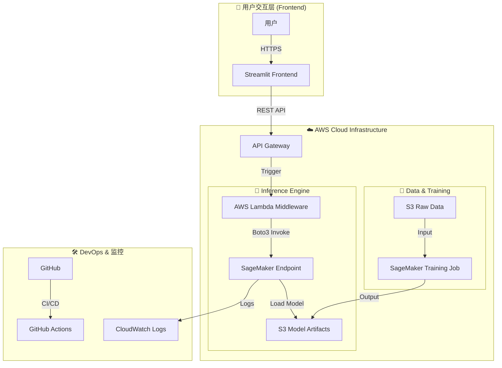

## 0. 协作与文档原则 (Collaboration Principle)

> 💡 **关键指令：** 在审查本文件或提供反馈时，如果对任何信息、状态或架构决策有疑问，请**务必提出疑问以寻求更多信息**。我们优先保证清晰度与准确性。

## 1. 宏观架构图 (High-Level Architecture)

**目标:** 实现模型训练、部署、以及前端交互的端到端 MLOps 流程。

---

## 2. 核心组件与技术栈说明

| 组件 | 技术栈 | 职责 |
| :--- | :--- | :--- |
| **Frontend** | `Streamlit` | 提供用户友好的交互界面，收集表单数据 (年龄, 睡眠时长等)。 |
| **API Gateway** | `AWS API Gateway` | 公网 HTTPS 入口，处理请求转发和安全鉴权。 |
| **Middleware** | `AWS Lambda` | 轻量级无服务器函数。负责输入校验、数据转换，并调用 SageMaker。 |
| **Model Serving** | `SageMaker Endpoint` | 托管最佳 SVM 模型，提供低延迟的推理服务。 |
| **Training** | `SageMaker Training` | 使用 `train.py` 进行环境清理和超参数调优 (HPO)。 |
| **Storage** | `AWS S3` | 存储原始数据 (`raw_data/`)、日志和训练好的模型 (`model.tar.gz`)。 |

---

## 3. 数据流向与可复现性

### 3.1 训练流 (Reproducibility)
本地 CSV 数据 -> S3 -> SageMaker Training Job -> S3 (Model Artifact)。

### 3.2 预测流 (Prediction Flow)
用户 -> Streamlit -> API Gateway -> Lambda -> SageMaker Endpoint -> Lambda -> Streamlit -> 用户。

---

## 4. 实时部署状态 (Real-time Deployment Status)

这是项目当前的部署状态，由 `deploy_manager.py` 脚本自动更新。

<!-- DEPLOYMENT_STATUS_START -->

_最后一次运行时间: 2025-12-04 13:36:20_

| 组件 (Component) | 状态 (Status) | 详情 (Details) |
| :--- | :--- | :--- |
| **S3 Storage** | ✅ Success | Bucket: `sleep-disorder-mlops-bucket` |
| **SageMaker Endpoint** | ❓ Failed (AWS Error: ValidationException) | Name: `sleep-disorder-svm-prod-v1` |
| **Lambda Function** | ❓ Failed (AWS Error: AccessDeniedException) | Name: `your-sleep-predictor-lambda-name` |
| **API Gateway** | ❓ Failed (AWS Error: AccessDeniedException) | ID: `abcdefg123` |
| **Frontend App** | ⏳ Pending | Local: `http://localhost:8501` |

<!-- DEPLOYMENT_STATUS_END -->
