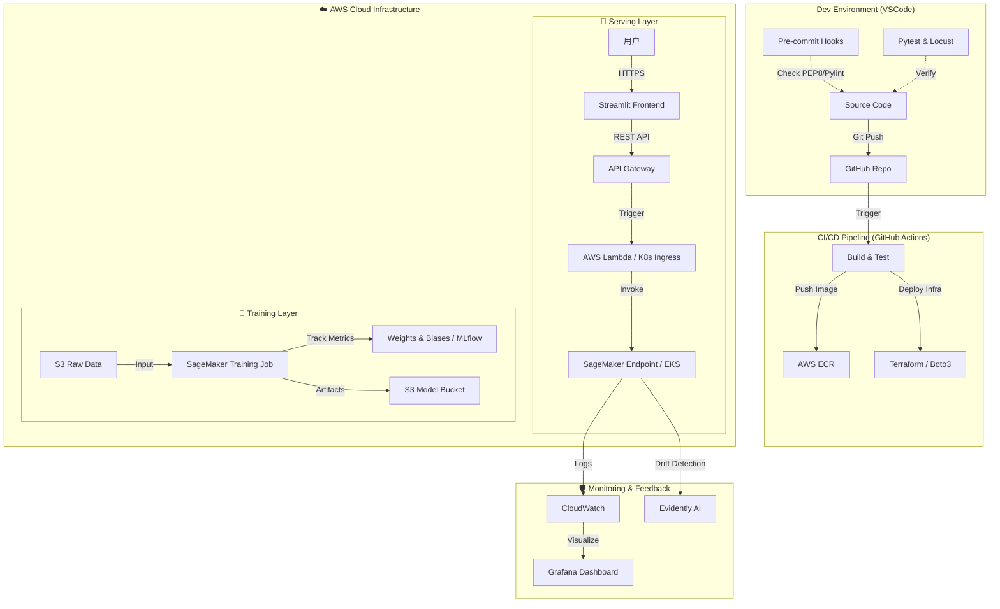

# MLOps 端到端架构与技术栈全景 (End-to-End Architecture & Tech Stack)

## 0. 协作与文档原则 (Collaboration Principle)

> 💡 **关键指令**：  
> 在审查本文件或提供反馈时，如果对任何信息、状态或架构决策有疑问，请务必提出疑问以寻求更多信息。  
> 我们优先保证**清晰度**与**准确性**，宁可多问，不可含糊。

---

## 1. 宏观架构图 (High-Level Architecture)

**目标**：实现符合 Clean Architecture 原则的模型训练、容器化部署与自动化 CI/CD 的完整端到端流程。

---

## 2. 技术栈详细映射 (Tech Stack & Roadmap)

本项目严格遵循现代 MLOps 最佳实践，技术栈分为 8 个核心阶段：

| 阶段 | 子领域 | 技术选型 | 说明 |
| :--- | :--- | :--- | :--- |
| **2.1 项目初始化与规范** | IDE 版本控制 环境管理 代码质量 | **VSCode** + Pylance **Git** + Feature Branch **Conda** / venv **PEP8** + Pylint + Pre-commit hooks | 强制代码风格与质量门禁 |
| **2.2 模块化开发** | 架构模式 测试框架 | **Clean Architecture** (src/api/deploy) **Pytest** + AAA 模式 | 业务逻辑、接口、基础设施完全解耦 |
| **2.3 训练流程** | 实验环境 云端交互 计算资源 实验追踪 | **Jupyter Notebook** **boto3** **SageMaker Training Jobs** **W&B**（首选）/ MLflow | 全链路实验可复现 |
| **2.4 基础设施与容器化** | 容器 镜像仓库 IaC | **Dockerfile** **AWS ECR** **Terraform**（规划中）+ boto3 | 构建一次，到处运行 |
| **2.5 部署与接口** | API 框架 ASGI 服务器 模型服务 编排选项 | **FastAPI** + Swagger **Uvicorn** **SageMaker Endpoints** EKS / Minikube（可选） | 高性能异步 API + 高可用托管 |
| **2.6 前端交互** | UI 通信协议 | **Streamlit** REST API (HTTP) | 快速构建交互式数据应用 |
| **2.7 CI/CD 自动化** | 流水线平台 工作流 | **GitHub Actions** Build → Test → Docker → Deploy | 主分支自动触发全流程 |
| **2.8 监控与测试** | 负载测试 数据监控 可观测性 发布策略 | **Locust** **Evidently AI** **CloudWatch** + Grafana A/B Testing | 全面保障生产稳定性 |

---

## 3. 数据流向 (Data Flow)

1.  **开发**：本地 `src/train.py` → Pytest → Git Push
2.  **CI/CD**：GitHub Actions 触发 → Docker Build → Push ECR
3.  **训练**：SageMaker 从 S3 拉数据 → 训练 → 模型存入 S3
4.  **部署**：SageMaker Endpoint 拉取 ECR 镜像 + S3 模型 → 启动 FastAPI
5.  **推理**：用户 (Streamlit) → API Gateway → Endpoint → 返回预测结果

前端架构：
graph LR
    subgraph "用户浏览器 (Client)"
        User[用户] --> |访问网页 :8501| FE[Streamlit 前端页面]
    end

    subgraph "EC2 实例 (Docker 容器)"
        FE --> |内部请求 http://localhost:8000| BE[FastAPI 后端接口]
        BE --> |调用| Model[训练好的模型]
    end

---

## 4. 实时部署状态 (Real-time Deployment Status)

> 由 `deploy_manager.py` 脚本自动更新  

<!-- DEPLOYMENT_STATUS_START -->

_最后一次运行时间: 2025-12-04 13:36:20_

| 组件 (Component) | 状态 (Status) | 详情 (Details) |
| :--- | :--- | :--- |
| **S3 Storage** | ✅ Success | Bucket: `sleep-disorder-mlops-bucket` |
| **SageMaker Endpoint** | ❓ Failed (AWS Error: ValidationException) | Name: `sleep-disorder-svm-prod-v1` |
| **Lambda Function** | ❓ Failed (AWS Error: AccessDeniedException) | Name: `your-sleep-predictor-lambda-name` |
| **API Gateway** | ❓ Failed (AWS Error: AccessDeniedException) | ID: `abcdefg123` |
| **Frontend App** | ⏳ Pending | Local: `http://localhost:8501` |

<!-- DEPLOYMENT_STATUS_END -->
